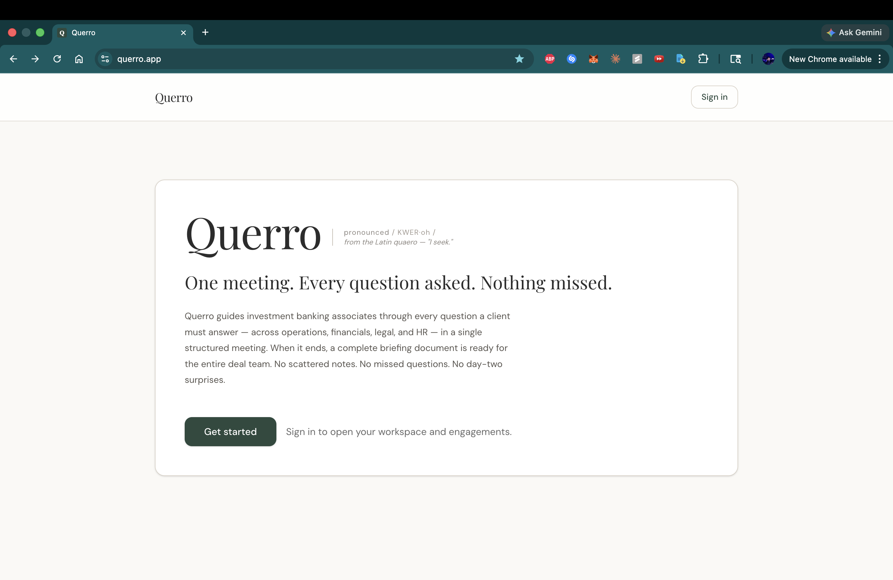
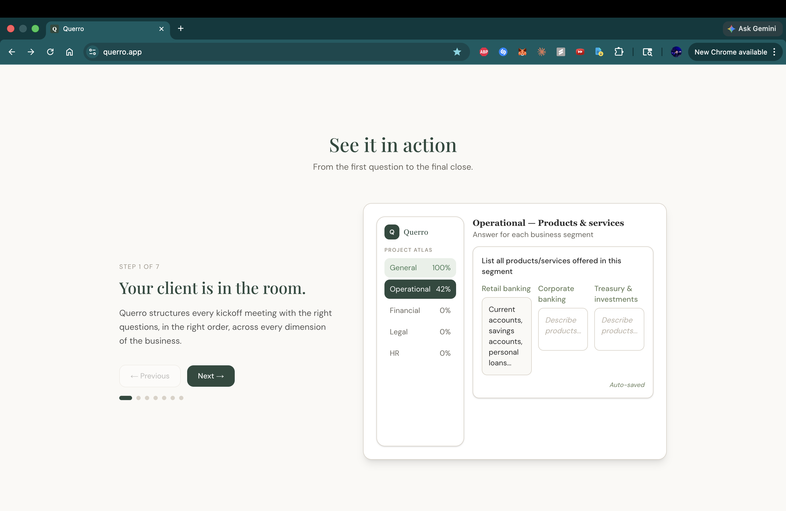
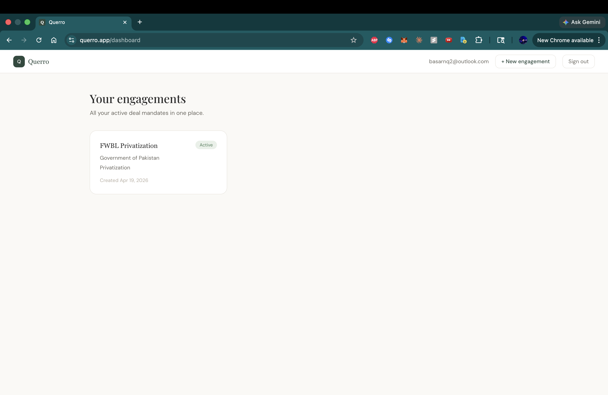
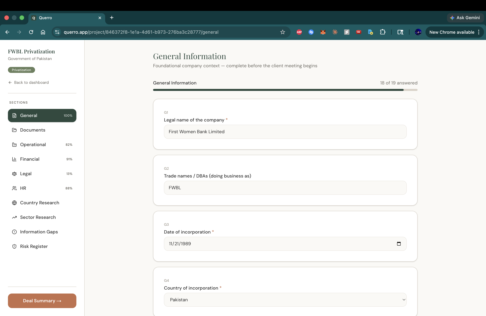
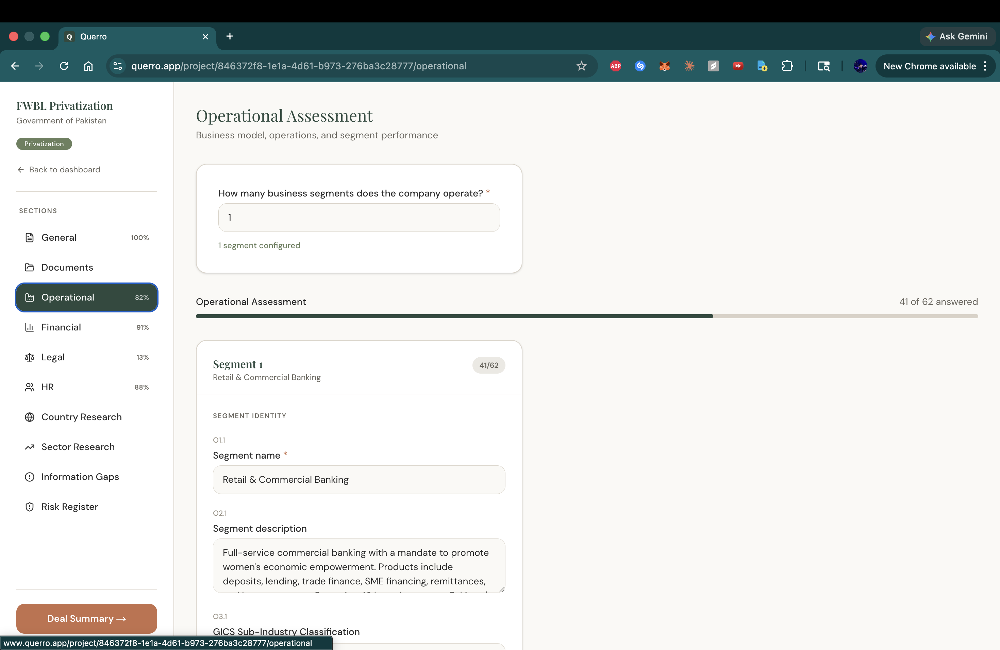
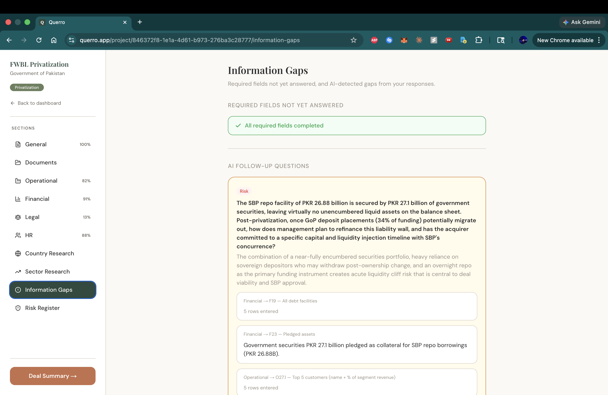
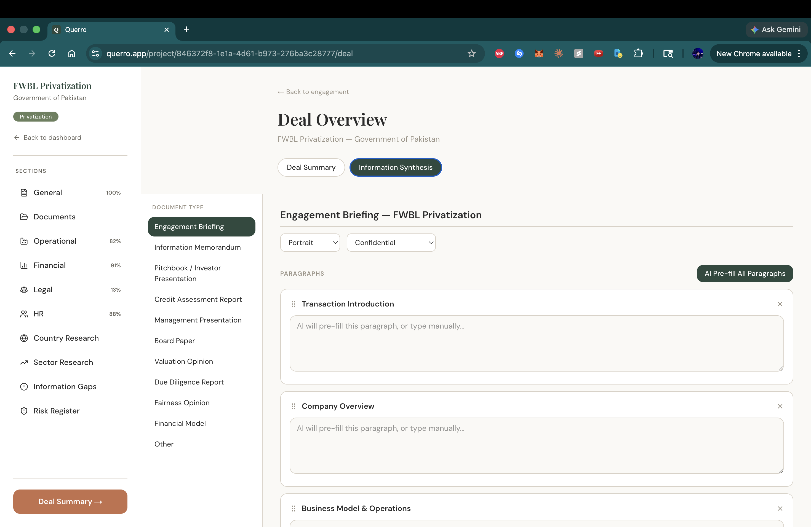
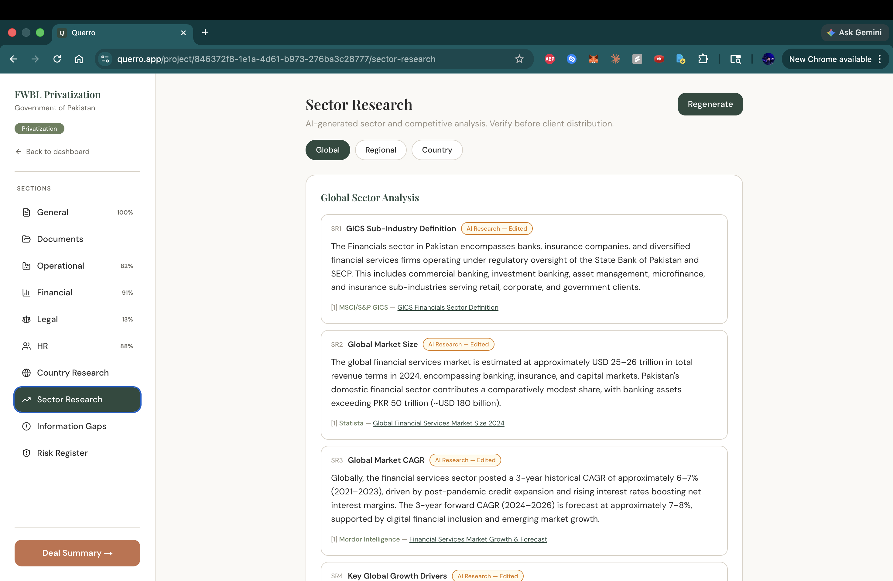

# Production State

This document is a literal description of what exists in production at [querro.app](https://querro.app). Everything below is verifiable by creating an account on the live site. The [Roadmap](06-roadmap.md) describes where the platform is heading; this document describes where it actually is.

The platform has been in active development since early April 2026. The current production build is a fully functional version 1, deliberately built on a static question library so that the contextual question architecture (described in [Platform Design](03-platform-design.md)) can be developed and tested against a working baseline. The dynamic question engine that replaces the static layer is in active development now.

## What works in production

### Authentication and account management

Email and password authentication, password reset, and session management. Per-firm data isolation enforced at the database level via row-level security. A user signing into the platform sees only their own engagements; cross-firm data leakage is structurally impossible rather than policy-enforced.

### Dashboard

A project dashboard listing all engagements the user has created, with metadata: project name, client legal name, mandate type, deal size, reporting and advisor currencies, jurisdictions, timeline, and progress percentage. New engagements are created via a multi-step modal that captures the engagement metadata and provisions the project in the database. Each project card routes to that engagement's workspace, and cards can be deleted with a confirmation modal.

### Structured questionnaire (version 1, static)

A 191-question questionnaire organized across five sections, modeling the kickoff information capture for a US middle-market investment banking engagement.

| Section | Questions | Coverage |
|---------|-----------|----------|
| General | 20 | Company background, contacts, mandate basics, deal scope |
| Operational | 62 | Business model, customers, competition, suppliers, geography, segments, KPIs |
| Financial | 46 | Historical performance, projections, capital structure, working capital, off-balance-sheet items |
| Legal | 39 | Corporate structure, contracts, IP, litigation, regulatory, ESG |
| HR | 23 | Headcount, key persons, compensation, turnover, labor relations |

Every question is rendered through a typed component supporting text, long-form text, single-select, multi-select, numeric, currency-aware numeric, date, percent, and table inputs. Each question carries metadata describing whether it is required, sensitive (for example, executive compensation detail, which carries a red flag), or concentration-flagged (auto-flagging at threshold values).

Responses auto-save with an 800-millisecond debounce. A user can leave the platform mid-question and resume exactly where they left off. Each section displays a real-time progress percentage computed from the share of required questions answered.

### Source attribution

Every answer in the questionnaire carries one of three source states: **AI Research** (answer was AI-generated and not yet reviewed), **Primary Research** (answer was entered or confirmed by the user), or **AI Research Edited** (answer was AI-generated and subsequently modified). These states persist through session changes and are visible to the deal team throughout the engagement.

### Adaptive question suggestions

When a user is filling out the questionnaire, the system surfaces follow-up questions tailored to the answers already given. These suggestions appear as cards inside the relevant section, each with an accept-or-dismiss control. Accepted suggestions become part of that engagement's question set; dismissed suggestions are logged and used to improve future suggestion quality.

### Briefing memo generation

A one-click action on the engagement workspace produces a professional briefing memo as a PDF, with the firm's branding applied. The memo is structured into eight sections covering company overview, deal context, business and operations, financials, legal and compliance, human capital, key risks, and next steps.

The memo is assembled by a deterministic compiler that maps structured questionnaire fields into the memo template. Two sections — the executive summary and the consolidated key risks — are augmented with AI-generated prose, bounded to roughly 600 and 800 tokens respectively. Every other section is rendered from structured fields without language model involvement. The full reasoning for this design is in [AI Philosophy](04-ai-philosophy.md).

The PDF is generated server-side and delivered as a download. Generation typically completes in under fifteen seconds.

### Risk register

A structured risk register synthesized from flagged questionnaire fields and organized by risk category. The risk register is generated on demand from the engagement record, with AI used to articulate the narrative and deterministic logic used to identify which fields trigger which risk categories. The register is editable by the deal team and propagates to the briefing memo's key risks section.

### Document upload

Users upload source materials — pitchbooks, financials, prior board decks, regulatory filings — and the platform stores them page-by-page with text extraction. Documents are displayed with editable filenames and a two-panel tag selector for categorizing each document against the engagement's question schema. The hard limit is 100 pages per document, enforced server-side on upload.

Document upload in the current production version handles storage and organization. The AI-assisted pre-fill of questionnaire answers from uploaded documents — where the platform extracts structured answers from document text and maps them to specific questions — is in active development.

### Sector research

A structured sector analysis covering competitive dynamics, peer set, current sector themes, and relevant market data. The research is organized across Global, Regional, and Country tabs, generated by AI with web search grounding, and rendered with inline source citations. Each AI-generated answer carries a source attribution badge indicating whether the user has reviewed and accepted it. Answers are editable in place.

### Sensitivity and concentration flagging

Specific questions are flagged at the schema level as sensitive — for example, executive compensation breakdowns trigger a visible indicator and a notice that the answer should be handled with care. Other questions are flagged as concentration risks — for example, customer concentration above a threshold automatically surfaces a warning in the operational section and propagates to the risk register.

### Landing page

The public landing page at querro.app explains the product to prospective customers. It includes an interactive seven-frame walkthrough demonstrating the flow from kickoff configuration through briefing memo generation.

## Technology stack

| Layer | Technology |
|-------|------------|
| Framework | Next.js (App Router), TypeScript |
| Styling | Tailwind CSS with a custom design system |
| Auth and database | Supabase (PostgreSQL with row-level security) |
| AI | Anthropic API, Claude Sonnet model family, no training on user data |
| PDF rendering | Server-side React PDF |
| Deployment | Vercel, auto-deploy from main branch |
| DNS | Cloudflare (DNS only) |
| Package management | pnpm |

The full source code is closed. The above describes only the infrastructure surface that is publicly observable.

## What is in active development

**Dynamic question tailoring.** The contextual architecture described in [Platform Design](03-platform-design.md) is in active development. The current questionnaire is a static superset of all investment banking questions; the dynamic question engine replaces it with a tailored subset per engagement, derived from the engagement's mandate type, the target's business model and sub-industry, applicable jurisdictions, and any active state modes.

**Document pre-fill.** The AI-assisted extraction of structured answers from uploaded documents, mapped to the composed questionnaire fields with page-level citations, is the next major feature area.

**Country research.** A structured country research brief generated for each jurisdiction in the engagement, covering macro context, regulatory environment, and recent transaction activity.

**Information gap detection.** Automatic identification of unanswered or weakly-answered questions, surfaced as a checklist for follow-up with the client.

**Financial model templates.** Spreadsheet-format financial model templates tailored to the engagement's mandate and industry. The structured engagement record populates the assumption inputs; the template does the arithmetic.

## Visual reference

Screenshots of the production environment, in order of the workflow they represent.

### Landing page

The public-facing entry point at [querro.app](https://querro.app), with the interactive walkthrough below the fold.

### Engagement dashboard

The post-login dashboard. Each card represents one active engagement and routes to that engagement's structured workspace.

### Structured questionnaire — General section

The first section of every engagement: company background, mandate basics, deal scope.

### Structured questionnaire — Operational section

The Operational section uses a card layout to keep long question sets readable. Sensitive questions carry a red border; concentration-risk questions auto-flag at threshold values.

### Adaptive question suggestions

Mid-questionnaire, the platform surfaces follow-up questions tailored to answers already given. Each suggestion is accepted, edited, or dismissed by the user.

### Briefing memo generation

The deterministic compiler runs server-side, augmented by two bounded language model calls (executive summary, consolidated risks). Generation completes in under fifteen seconds.

### Sector research

Structured sector analysis with inline source citations. AI-generated answers carry source attribution badges; each answer is editable by the deal team.

## Honest assessment of maturity

Querro is, today, a working version 1 of a deal advisory platform. It is functional end-to-end: a banker can sign up, create an engagement, fill out the structured questionnaire, upload supporting documents, generate a branded PDF briefing memo, review AI-generated sector research, and download the outputs.

It is not yet a finished product. The dynamic question engine that gives the architecture its leverage is being built now. The document pre-fill, country research, information gap detection, and financial model features are the next phase of the build. Pilot customer rollout is targeted for the third quarter of 2026, after the v2.0 build is feature-complete.

Treat the live site as a credible technical demonstration, not a finished commercial product. The architectural claims in this repository are claims about where the platform is going. The live site is evidence of the building capacity, not of the destination.
